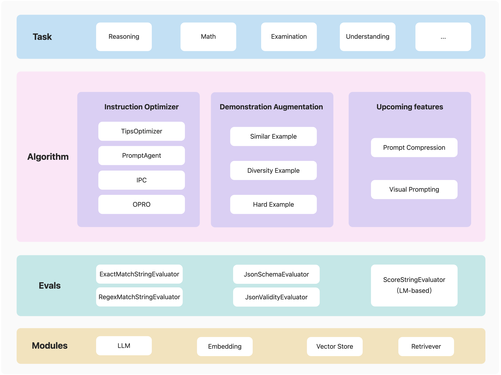

<p align="center">
    <br>
    
    <br>
<p>
<p align="center">


## 📝 Introduction
Welcome to PromptScope! In the ever-evolving landscape of artificial intelligence, effective prompt design is crucial for maximizing the performance of language models. PromptScope is a powerful tool designed to streamline this process by providing two essential functionalities: generating demonstrations for in-context learning and optimizing prompts for enhanced efficacy.

<p align="center">
    <br>
    
    <br>
<p>
<p align="center">

PromptScope supports English and Chinese, with OpenAI and Qwen Models for now. Dive in to unlock the full potential of intelligent language generation!

## 🎉 News
- 2025-01-20: Add TipsOptimizer for Instruction Optimization
- 2024-12-12: PromptScope is released.

## 🛠️ Installation:

PromptScope requires Python 3.9 or higher.

Note: This project is currently in active development, it's recommended to install from source.

## 🚀 Getting Started
We provide:
- Examples for Instruction Optimization:
  - [Example](examples/static_tips_optimization_examples) for Tips Optimization.
  - [Example](examples/ipc_examples) for IPC.
  - [Example](examples/opro_examples) for OPRO.
  - [Example](examples/prompt_agent_examples) for PromptAgent.
- Examples for Demonstration Augmentation:
  - [Examples](examples/diversity_augmentation_examples) for diversity example generation.
  - [Examples](examples/similar_augmentation_examples) for similar example generation.
  - [Examples](examples/hard_augmentation_examples) for hard example generation.

## 💡 Contribute
Contributions are always encouraged!

We highly recommend install pre-commit hooks in this repo before committing pull requests.
These hooks are small house-keeping scripts executed every time you make a git commit,
which will take care of the formatting and linting automatically.
```shell
pip install -e .
```

## 🏛 License

This framework is licensed under the [Apache License (Version 2.0)](https://github.com/modelscope/modelscope/blob/master/LICENSE). 

## 💻 Acknowledgement
This project utilizes [AutoPrompt](https://github.com/Eladlev/AutoPrompt), [OPRO](https://github.com/google-deepmind/opro) and [PromptAgent](https://github.com/XinyuanWangCS/PromptAgent) libraries, which are licensed under the Apache License, Version 2.0.


