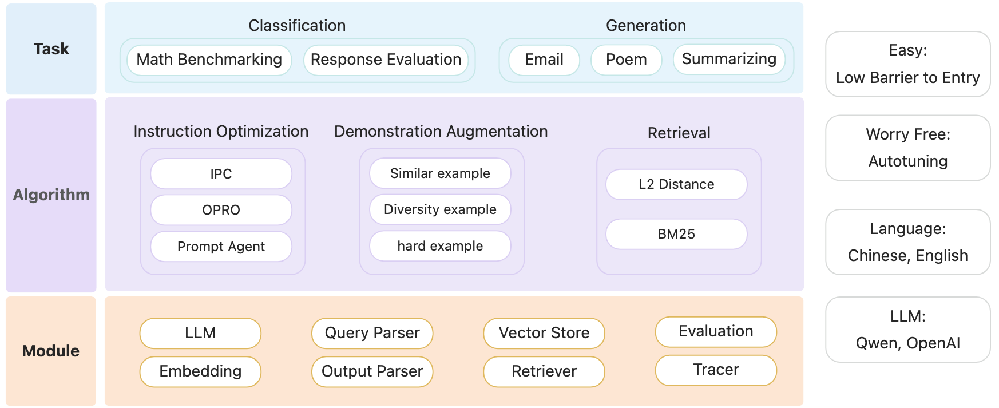

<p align="center">
    <br>
    
    <br>
<p>
<p align="center">


## 📝 Introduction
Welcome to PromptScope! In the ever-evolving landscape of artificial intelligence, effective prompt design is crucial for maximizing the performance of language models. PromptScope is a powerful tool designed to streamline this process by providing two essential functionalities: generating demonstrations for in-context learning and optimizing prompts for enhanced efficacy.

<p align="center">
    <br>
    
    <br>
<p>
<p align="center">

PromptScope supports English and Chinese, with OpenAI and Qwen Models for now. Dive in to unlock the full potential of intelligent language generation!

## 🎉 News
- : PromptScope is released.

## 🛠️ Installation:

PromptScope requires Python 3.9 or higher.

Note: This project is currently in active development, it's recommended to install from source.

## 🚀 Getting Started

We provide (1) examples for similar and diversity demonstration generation. (2) [examples](examples/offline_examples/example.md) for prompt optimization with IPC, OPRO and PromptAgent.

## 🖋 Contributing

Contributions are always welcomed!

We provide a developer version with additional pre-commit hooks to perform
checks compared to the official version:

```bash
# For windows
pip install -e .[dev]
# For mac
pip install -e .\[dev\]

# Install pre-commit hooks
pre-commit install
```

## 🏛 License

This framework is licensed under the [Apache License (Version 2.0)](https://github.com/modelscope/modelscope/blob/master/LICENSE). 

## 💻 Acknowledgement
This project utilizes [AutoPrompt](https://github.com/Eladlev/AutoPrompt), [OPRO](https://github.com/google-deepmind/opro) and [PromptAgent](https://github.com/XinyuanWangCS/PromptAgent) libraries, which are licensed under the Apache License, Version 2.0.


