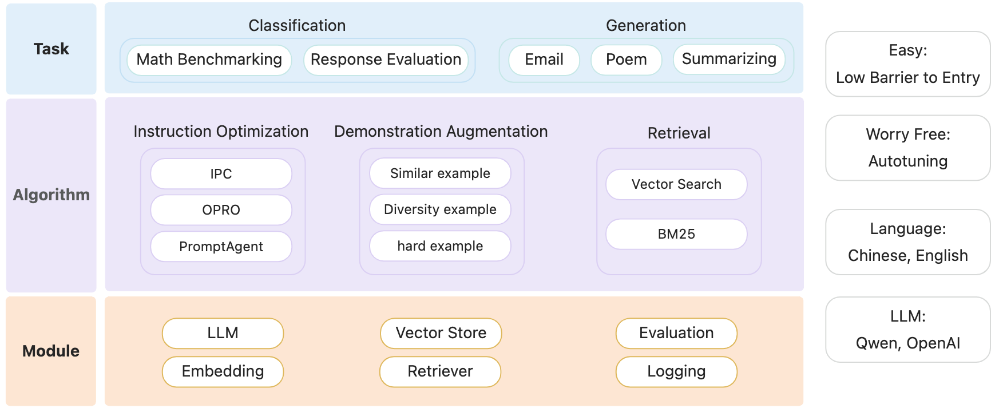

<p align="center">
    <br>
    
    <br>
<p>
<p align="center">


## 📝 Introduction
Welcome to PromptScope! In the ever-evolving landscape of artificial intelligence, effective prompt design is crucial for maximizing the performance of language models. PromptScope is a powerful tool designed to streamline this process by providing two essential functionalities: generating demonstrations for in-context learning and optimizing prompts for enhanced efficacy.

<p align="center">
    <br>
    
    <br>
<p>
<p align="center">

PromptScope supports English and Chinese, with OpenAI and Qwen Models for now. Dive in to unlock the full potential of intelligent language generation!

## 🎉 News
- : PromptScope is released.

## 🛠️ Installation:

PromptScope requires Python 3.9 or higher.

Note: This project is currently in active development, it's recommended to install from source.

## 🚀 Getting Started

We propose that an effective prompt structure consists of three key components: the instruction, which outlines the task description; the demonstration, which provides ideal input-output examples; and the query, which specifies the particular question being posed. This tripartite framework facilitates a clearer understanding of the task at hand, enhances the quality of the model's responses, and ultimately improves overall performance in various applications.

<p align="center">
    <br>
    
    <br>
<p>
<p align="center">

On top of that, we provide:
- [Examples](examples/offline_examples/demo_augmentation_examples/) for similar and diversity demonstration generation.
- [Examples](examples/offline_examples/example.md) for instruction optimization with IPC, OPRO and PromptAgent.
- [Example](examples/gsm8k_example) for an end-to-end prompt optimization workflow on GSM-8K benchmark, with both demonstration augmentation and instruction optimization.

## 🖋 Contributing

Contributions are always welcomed!

We provide a developer version with additional pre-commit hooks to perform
checks compared to the official version:

```bash
# For windows
pip install -e .[dev]
# For mac
pip install -e .\[dev\]

# Install pre-commit hooks
pre-commit install
```


## 💡 Contribute

Contributions are always encouraged!

We highly recommend install pre-commit hooks in this repo before committing pull requests.
These hooks are small house-keeping scripts executed every time you make a git commit,
which will take care of the formatting and linting automatically.
```shell
pip install -e .
pre-commit install
```

## 🏛 License

This framework is licensed under the [Apache License (Version 2.0)](https://github.com/modelscope/modelscope/blob/master/LICENSE). 

## 💻 Acknowledgement
This project utilizes [AutoPrompt](https://github.com/Eladlev/AutoPrompt), [OPRO](https://github.com/google-deepmind/opro) and [PromptAgent](https://github.com/XinyuanWangCS/PromptAgent) libraries, which are licensed under the Apache License, Version 2.0.


